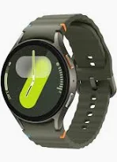

<!DOCTYPE html>
<html lang="en">
<head>
  <meta charset="UTF-8" />
  <meta name="viewport" content="width=device-width, initial-scale=1.0"/>
  <title>Amazon Clone</title>
  
</head>
<body>

  <!-- 🔥 Creative & Responsive Header -->
  <header class="header">
    
amazon.in

    <nav class="nav-links">
      <a href="#">Home</a>
      <a href="#">Deals</a>
      <a href="#">Electronics</a>
      <a href="#">Fashion</a>
      <a href="#">Cart</a>
    </nav>
    

      <input type="text" placeholder="Search Amazon.in"/>
    

  </header>

  <!-- 🔥 Hero Section -->
  <section class="hero-banner">
    

      <h1>Great Deals on Electronics</h1>
      
Explore top offers with free delivery

      <a href="#" class="hero-btn">Shop Now</a>
    

  </section>

  <!-- 🔥 Products -->
  <section class="products">
    <h2>Featured Products</h2>
    

      

        
        <h3>Wireless Headphones</h3>
        
₹2,499

        <a href="#" class="btn">Add to Cart</a>
      

      

        
        <h3>Bluetooth Speaker</h3>
        
₹1,799

        <a href="#" class="btn">Add to Cart</a>
      

      

        
        <h3>Smart Watch</h3>
        
₹3,299

        <a href="#" class="btn">Add to Cart</a>
      

    

  </section>
  <section class="contact-section" id="contact">
  

    <h2>Contact Us</h2>
    <form>
      <input type="text" placeholder="Your Name" required>
      <input type="email" placeholder="Your Email" required>
      <textarea rows="5" placeholder="Your Message" required></textarea>
      <button type="submit">Send Message</button>
    </form>
  

</section>

  <!-- 🔥 Footer -->
  <footer>
    
© 2025 Amazon Clone. Built for practice.

  </footer>

</body>
</html>
